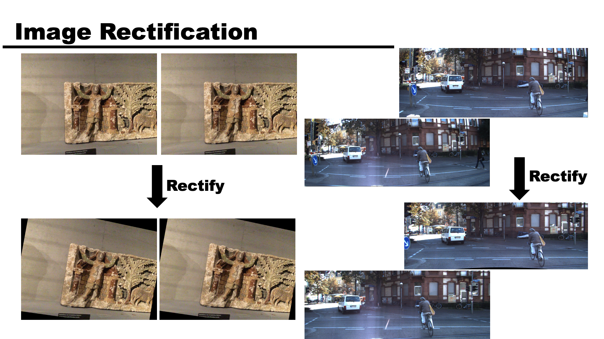
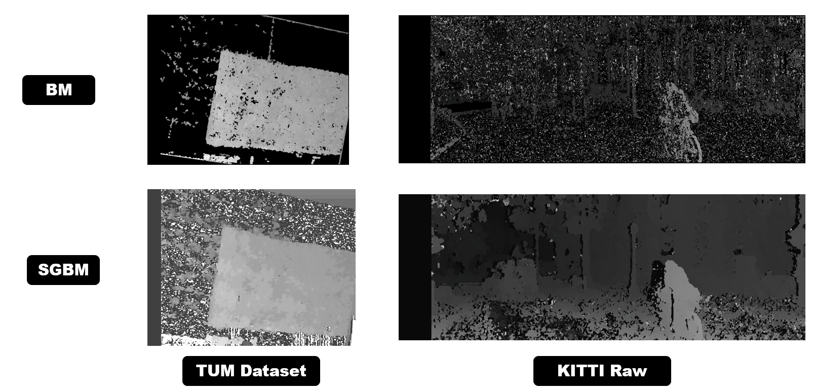
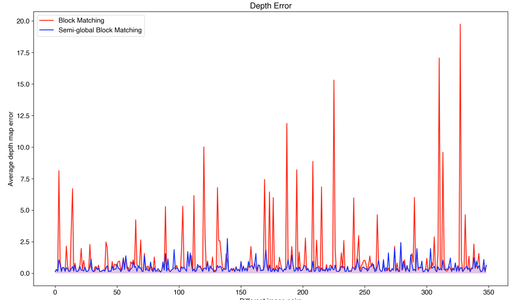
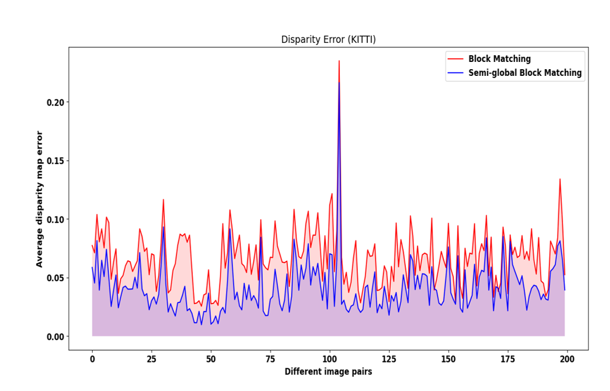
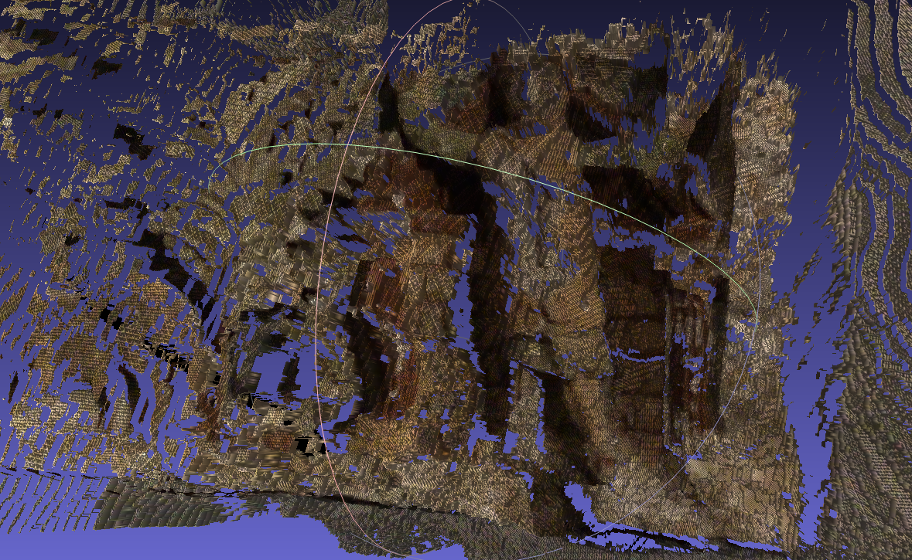

# 3D Scanning Final Project - Stereo Reconstruction

## References

* [Weekly Report](https://docs.google.com/document/d/1K6K0ElHKk27aSyPWNIXJ57GBT3060mLvXEGucMk_U0U/edit)


## Project's overview
This project proposes a pipeline for comparing different stereo reconstruction methods and has already been tested on two datasets with successful results.  The pipeline involves the following steps: camera calibration to remove image distortion, key points extraction and matching to rectify images, dense stereo matching to calculate disparity maps and obtain depth information, and final 3D model generation from the calculated depth maps.

The project will implement various stereo-matching algorithms such as StereoSGBM and StereoBM and perform post-filtering to increase the quality of the disparity map. The 3D points will be calculated from the stereo correspondences and disparity values, and then merged into a complete 3D model using ICP or an improved algorithm. The aim of this project is to compare the performance of different stereo reconstruction methods and obtain the optimal solution for 3D modelling.


## Setting up this project
Required packages:
- OpenCV
- Eigen3
- FLANN
- Ceres

Datasets:
- TUM Intrinsic3D: Features 5 scenes captured in RGB-D using a Structure.io depth sensor and iPad camera. The sensor has 640x480 resolution, the camera 1296x968. It can be downloaded [here](https://vision.in.tum.de/data/datasets/intrinsic3d)
- Kitti Stereo 2015: A benchmark dataset for evaluating the performance of stereo-based 3D object detection and tracking algorithms which can be downloaded [here](https://www.cvlibs.net/datasets/kitti/eval_scene_flow.php?benchmark=stereo)


## Running the code
```
git clone https://github.com/lptl/3DScanning.git
mkdir build && cd build
cmake .. && make
./StereoReconstruction
```

* See defined macros in `main.cpp` and `Libs/Pipeline.h` to decide the whole running procedure.
* See `CMakeLists.txt` for libraries installation.

## Results
Rectification


Sparse matching


Generate disparity map


Depth error for TUM


Depth error for Kitti


Generated point cloud  
TUM


Kitti


## Credits
This undertaking constitutes the hands-on component of the course "3D Scanning and Motion Capturing" at the Technical University of Munich. The roster of team participants includes:

- Anish Pathak
- Guowen Huang
- Wenzhao Tang
- Xiaoheng Hu